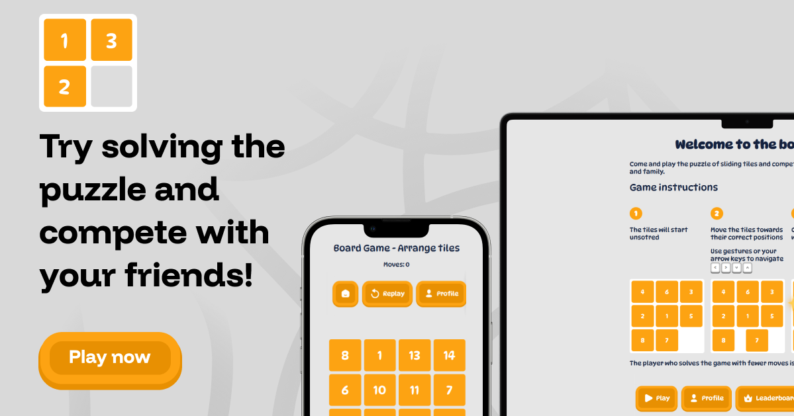
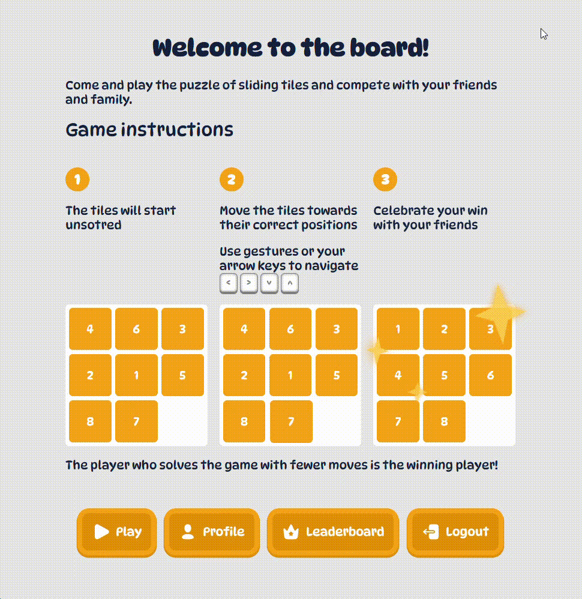
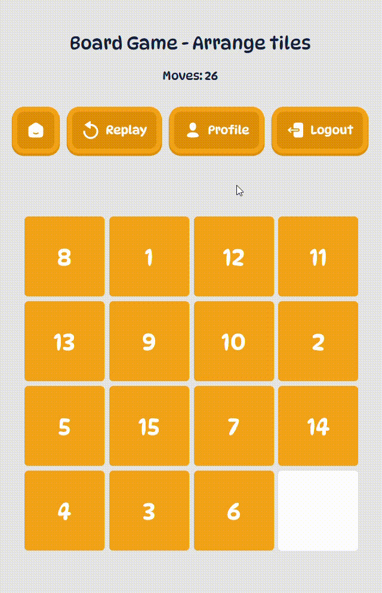

# 🎮 Sliding Tiles Puzzle

  

# [Play now](https://saadlaggoun.github.io/Sliding-Tiles-Puzzle/)

> A fun little proof-of-concept project that snowballed into a feature-rich, colorful, animated puzzle playground – all built with 100% **vanilla** web technologies 🍦.

## 🧩 What is this?

**Sliding Blocks Puzzle** is a tile-based logic game where your goal is to arrange blocks in order by sliding them around — you know the one! Think of it like digital Tetris’.

This project started as a tiny console game and grew into a full-blown, modular, animated experience with users, scores, confetti 🎉, and more.

---

## 🎯 Why This Exists

> "Frameworks? Never heard of 'em." – \_Me

My mentees wanted a proof-of-concept so I gave them one. I created the Sliding Blocks Puzzle game in the console to show them how its done and for them to follow. But It kept itching me why I don't go bigger. So I made it into what it is. A full-blown interface of game Sliding Blocks!

This game is pure HTML/CSS/JS application made to **prove the power of vanilla web technologies**. No frameworks, no libraries, no dependencies. Just **brain + browser**. It serves as an architectural and interactive **proof of competence**.

---

## 🛠️ Tech Stack

| Layer         | Tech Used                            |
| ------------- | ------------------------------------ |
| 💻 Markup     | HTML5                                |
| 🎨 Styling    | Modern CSS (grid, flex, animations!) |
| ⚙️ Logic      | JavaScript (ES6 Modules)             |
| 💾 Storage    | LocalStorage                         |
| 🚫 Frameworks | None, zero, zilch                    |

---

## 🎮 How to Play

-  Open the app.
-  Signup for the game.
-  Choose your board size: `3x3`, `4x4`, or `5x5`.
-  Slide the tiles using:
   -  Arrow keys ⬅️⬆️⬇️➡️
   -  Mouse clicks 🖱️
   -  Touch gestures 📱
-  Try to solve the puzzle in as few moves as possible!
-  Beat your high score, get a confetti shower 🎉.
-  Climb the leaderboard, view your profile, replay, or logout.

(_No tutorial needed… but there's one built-in anyway! 😎_)

---

## ✨ Features

-  MVC-inspired **custom architecture** built from scratch.
-  **Dynamic rendering** with modular ES6 structure:
-  Fully **responsive UI** and device support (mouse, keyboard, touch).
-  Playable in all major modern browsers.
-  **Authentication system** with signup/login/logout.
-  Dynamic **navigation system** with multiple pages.
-  Choose board sizes dynamically.
-  Interactive **leaderboard** with scores.
-  **Replay mid-game** with different board sizes.
-  **Profile view** with stats.
-  Delightful **animations** and confetti for winners 🎉.
-  Uses **localStorage** as a database.
-  1500+ lines of code 💪, organized cleanly with love.
-  Built to be **fun, performant, and mostly bug-free**.

---

## 📸 Screenshots & GIFs

  

  

---

## 🛠️ Development Journey

Like any worthy puzzle, this project was built **one tile at a time**. Here's how it evolved:

### 🧪 Stage 0: Console Beginnings – Matrix

It all started in the humble **JavaScript console**.

-  The game logic was written using a **2D matrix** to represent the board.
-  Moves were handled by modifying the matrix and re-rendering it using `console.table()` for clarity (and some style 😎).
-  This stage was all about getting the **core mechanics** of the sliding puzzle right – no UI, just logic.

---

### 🎨 Stage 1: Interface Rises

After the basics worked, I got an itching feeling to built an interface upon it and wanted.

-  After working with the 2D Array it was clear during the UI build that it should not be this way. It was clear to use it in the console, But there is no need for it now.
-  The 2D matrix was replaced with a **1D array** to simplify index calculations and **boost performance**.
-  Logic for identifying neighbor positions, blank tiles, and legal moves was reworked with clean arithmetic.
-  The underlying game engine became leaner, faster, and ready for a UI.
-  A **graphical interface** was introduced using HTML and CSS.
-  The board now rendered dynamically in the DOM, with tiles that moved visually when using the arrow keys or hand gestures for touch devies.
-  This was the first time the game truly felt interactive. No more `console.log`, just clean tiles gliding around.
-  Even the interactions are blazing fast and takes only few milliseconds. LCP is below 0.7 seconds and the CLS is ZERO

---

### 🧱 Stage 2: Modularization – MVC-Like

Structure matters.

-  The project was restructured into **ES6 modules** to separate concerns and follow a **custom MVC-like architecture**:
   -  `rendering` – handles drawing everything on screen.
   -  `navigation` – dynamic routing-like system.
   -  `components` – reusable UI blocks.
   -  `utils` – helper functions.
   -  `storage` – managing local storage.
   -  `games` – core logic and mechanics.
-  This made the project easier to maintain, expand, and teach to others.

---

### 🔐 Stage 3: Authentication & UX – More Than Just a Game

The game started becoming a **full-fledged web application**.

-  Built a **sign-up and login** system using local storage.
-  Introduced a **welcoming splash screen** with smooth animations and game instructions.
-  Added **dynamic navigation** to handle multiple pages and views.

---

### 🏁 Stage 4: Game Modes & Competition

-  Players could now choose between board sizes: `3x3`, `4x4`, or `5x5`.
-  Added a **leaderboard** to track best performances by board size.
-  Implemented **replay** functionality mid-game with preserved scores.

---

### 👤 Stage 5: Profiles & Personalization

-  Introduced a **profile view** to let players:
   -  See their past score.
   -  Compare their performances across board sizes.
-  Included **logout** functionality.

---

### 🎉 Stage 6: Polish & Delight – Confetti & Touch Magic

-  Full **support for mouse, keyboard, and touch gestures**.
-  **Confetti animation** to celebrate victories 🎉.
-  Added fun little animations and interactions across the app.
-  All UI elements were styled with cleand and modern CSS.
-  Game became **highly performant**, checking for edge cases and handling inputs gracefully.

---

### 📦 The Final Result

From a lonely matrix in the console to a colorful, animated, and modular sliding puzzle platform:

-  100% **vanilla** web stack
-  1500+ lines of clean, documented, commented code
-  A complete journey that demonstrates **how far you can go without a single dependency**
-  Since the game involved many cycles of development. The refactoring it got was huge. Both the data-structures and logic got improved drastically from the first draft. I had to rework some of the part to squize performance gains.

---

### Lessons taken

Since the project had many development shifts. That work needed a lot of refactoring. The following stage and the previous ones were very distinguishable between each other. Many state has been moved from its original place and and some components got reconsidered and even the game engine had to adapt. This reminded my that's the most important skill a developer should hold isn't know to to build, but how to learn and refactor the existing code.

> This is a proof-of-concept type of project that is a part of a big series that I use for my mentees to expirement on. I am currently mentoring two stubborn dudes that want to enter tech. This would be the first project example from a bunch to come 🚀

---

## 📈 Future Improvements

-  Add proper authentication and authorization
-  Add proper routing using hashs
-  Create a store to manage state for better data manipulations
-  Create the Backend for the project and omit the Local Storage approach

## 🤝 Contributing

Yes please!  
If you want to help improve this fun playground, feel free to open issues or submit PRs.

1. Fork it 🍴
2. Make your changes ✍️
3. Submit a pull request ✅

---

## 🙏 Credits

-  The Confetti effect to [@Kcreation-MTech](https://codepen.io/Kcreation-MTech)
-  SVG icons to [SVGrepo](https://www.svgrepo.com/)

## 📜 License

This project is licensed under the **Creative Commons Attribution 4.0 International (CC BY 4.0)** License.  
You’re free to use, share, remix, or build upon it — just **give proper credit**. 🎓

[Read the full license text here.](https://creativecommons.org/licenses/by/4.0/)

---

Built with ❤️, designed for fun, and crafted to inspire.

---
